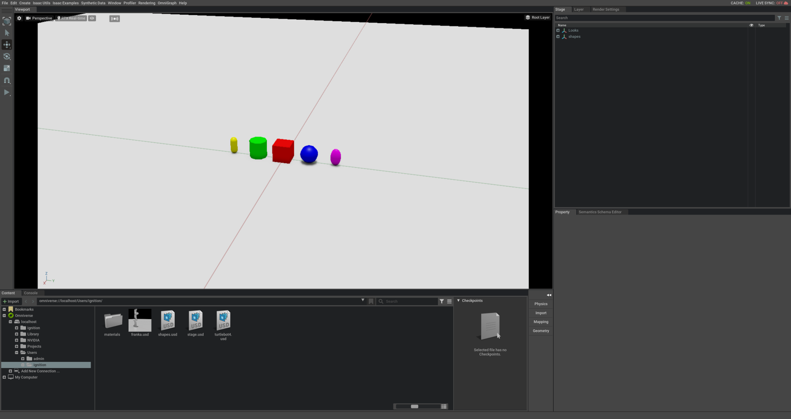

# ign-omni

**NOTES**:
 - This repository is under development, you might find compilation errors,
malfunctions or some undocumented features.
 - This code will only run on Linux (for now).
 - You should [install Ignition Fortress](https://ignitionrobotics.org/docs/fortress) (from source).

**Requirements**:
 - ROS 2 Galactic.
 - Ignition Gazebo Fortress
 - ubuntu 20.04

**Features**:
 - Ignition -> IssacSim
   - Move/rotate models
   - Create/remove models
   - Joints
   - Sensors (lidar, cameras)
 - IssacSim -> Ignition
   - Create/remove models

## How to compile it

### Compile ignition

```bash
sudo apt install python3-pip wget lsb-release gnupg curl
sudo sh -c 'echo "deb http://packages.ros.org/ros/ubuntu $(lsb_release -sc) main" > /etc/apt/sources.list.d/ros-latest.list'
curl -s https://raw.githubusercontent.com/ros/rosdistro/master/ros.asc | sudo apt-key add -
sudo apt-get update
sudo apt-get install python3-vcstool python3-colcon-common-extensions
sudo apt-get install git

# get sources
mkdir -p ~/ignition-fortress/src
cd ~/ignition-fortress/src
wget https://raw.githubusercontent.com/ignition-tooling/gazebodistro/master/collection-fortress.yaml
vcs import < collection-fortress.yaml

# install dependencies
sudo wget https://packages.osrfoundation.org/gazebo.gpg -O /usr/share/keyrings/pkgs-osrf-archive-keyring.gpg
echo "deb [arch=$(dpkg --print-architecture) signed-by=/usr/share/keyrings/pkgs-osrf-archive-keyring.gpg] http://packages.osrfoundation.org/gazebo/ubuntu-stable $(lsb_release -cs) main" | sudo tee /etc/apt/sources.list.d/gazebo-stable.list > /dev/null
sudo apt-get update
sudo apt -y install \
  $(sort -u $(find . -iname 'packages-'`lsb_release -cs`'.apt' -o -iname 'packages.apt' | grep -v '/\.git/') | sed '/ignition\|sdf/d' | tr '\n' ' ')

# build
cd ~/ignition-fortress
colcon build --cmake-args -DCMAKE_BUILD_TYPE=Release -DBUILD_TESTING=OFF --merge-install
```

For more information, see https://ignitionrobotics.org/docs/fortress/install_ubuntu_src.

## Compile ignition-omniverse

We need to compile some Ignition packages from source with a specific flag due the `omni-client` library.
To make this process simple we have created the [`ign-omni-meta` repository](https://github.com/ignitionrobotics/ign-omni-meta).

To compile this libraries you should run:

```bash
mkdir -p ~/ign-omni/src
cd ~/ign-omni/src
git clone https://github.com/ignitionrobotics/ign-omni-meta
vcs import . < ign-omni-meta/repos.yaml
cd protobuf
git -C . apply ../ign-omni-meta/protobuf-cmake.patch
cd ~/ign-omni
colcon build --merge-install --event-handlers console_direct+ --packages-select protobuf
cp src/ign-omni-meta/colcon.meta .
colcon build --merge-install --event-handlers console_direct+ --packages-up-to ignition-omniverse1
```

**Note: There will be 2 builds of ignition, the default build when ignition-fortress is compiled from source, and a special build with pre cxx11 abi compiled as part of ignition-omniverse.**

## Run it

### Run Ignition

Run the `shapes.sdf` world in Ignition Gazebo. This should run in a separate terminal using your normal Ignition Gazebo installation.

```bash
source ~/ignition-fortress/install/setup.bash
ign gazebo -v 4 shapes.sdf
```

### Run IssacSim

If not already done so, install nvidia omniverse, isaac sim and omniverse nucleus, for more information, see https://www.nvidia.com/en-us/omniverse/.

#### (Optional) Create ignition user in nucleus
When nucleus is first installed, it will prompt you to create a user. If the ignition user is not created at this time, it can be created later via the omniverse app.


Launch `IssacSim` and activate the `live sync`


### Run the connector

And finally run:

**Note**: `ignition-omni` will be built under `src/ign-omni/_build`, this is because
it uses a custom build system by NVidia which is hard coded to put output in that directory.

In this case you need to source the special workspace that we have created
with the `ign-omni-meta` repository.

In a new terminal

```bash
source ~/ign-omni/install/setup.bash
cd ~/ign-omni/src/ign-omni
bash run_ignition_omni.sh -p omniverse://localhost/Users/ignition/shapes.usd -w shapes --pose ignition
```

You may replace `ignition` with any user registered in nucelus.

Open the `shapes.usd` in isaac and optionally enable live sync.



## Run a more complex simulation

<!-- TODO: Replace this with turtlebot4 instructions https://github.com/ignitionrobotics/ign-omni/pull/17 -->

For example you can run the turtlebot3. Compile the code from this PR https://github.com/ROBOTIS-GIT/turtlebot3_simulations/pull/180

Use ROS 2 Galactic.

```
mkdir -p ~/turtlebot3_ws/src
cd ~/turtlebot3_ws/src
git clone https://github.com/ahcorde/turtlebot3_simulations -b ahcorde/ignition_support
git clone https://github.com/ignitionrobotics/ign_ros2_control -b galactic
rosdep install --from-paths ./ -i -y --rosdistro galactic
```

Compile it

```bash
cd ~/turtlebot3_ws/
source /opt/ros/galactic/setup.sh
export IGNITION_VERSION=fortress
colcon build --merge-install --event-handlers console_direct+
```
### Run Ignition

This should run in a separate terminal using your normal Ignition Gazebo installation.

```bash
source ~/turtlebot3_ws/install/setup.bash
export TURTLEBOT3_MODEL=waffle ros2 launch turtlebot3_ignition ignition.launch.py
```

### Run IssacSim

Launch `IssacSim` and activate the `live sync`


### Run the connector

Create this directory `omniverse://localhost/Users/ignition/` in the nucleus server  and run the connector

```bash
reset && bash run_ignition_omni.sh -p omniverse://localhost/Users/ignition/turtlebot3.usd -w empty -v
```


