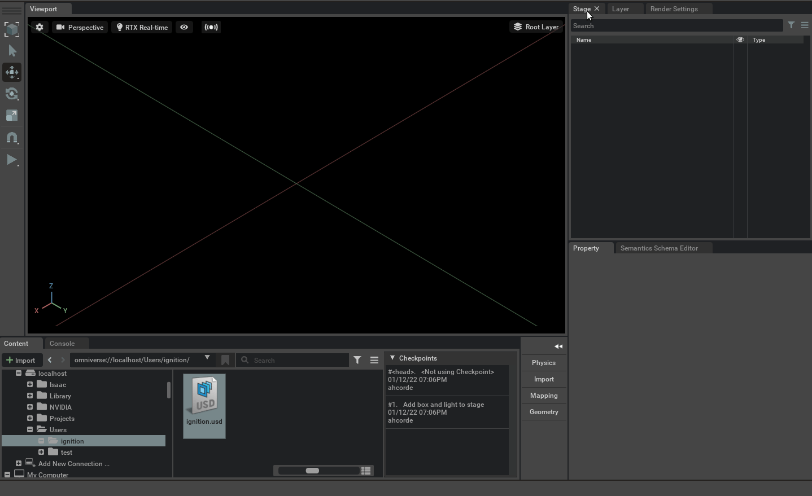

#

To compile this you should modify `ignitionInstallDir` in premake5.lua with your path to ignition.

Define the environment variable

```bash
export IGNITION_INSTALL_DIR=~/ignition_ws/install
```

Then you should run the script `bash build.sh`

If you are compiling ignition from sources remember to:

```bash
source ~/ignition_ws/install/setup.bash
```

Launch `IssacSim` and activate the `live sync`



And finally run:

```bash
bash run_ignition.bash
```

# Connect Samples for the Omniverse Client Library

Currently there are two examples in the source folder:
* helloWorld - a C++ sample that shows how to connect to an Omniverse Nucleus server, create a USD stage, create a polygonal box, bind a material, add a light, save data to .usd file, and do live edits
* pyHelloWorld - demonstrates all of the same things from the C++ sample in Python
* omnicli - a very useful command line utility to manage files on an Omniverse Nucleus server
* omniUsdaWatcher - a live USD watcher that outputs a constantly updating USDA file on disk
* omniUSDReader - a very very simple program for build config demonstration that opens a stage and traverses it, printing all of the prims

## Using the prebuilt package from the Omniverse Launcher

If the Connect Sample was downloaded from the Omniverse Launcher then these two programs are already built and can be run with these commands:
* run_sample.bat (--help)
* omni_cli.bat (help)

They both accept command line arguments are best experienced from a Command Prompt.

If you are interested in building these samples yourself, proceed to the [`How to build`](#how-to-build) section to download all of the build dependencies and build the samples.

## How to build

### Linux
This project requires "make" and "g++".

Open a terminal.  
To obtain "make" type ```sudo apt install make``` (Ubuntu/Debian), or ```yum install make``` (CentOS/RHEL).  
For "g++" type ```sudo apt install g++``` (Ubuntu/Debian), or ```yum install gcc-c++``` (CentOS/RHEL).  

Run build script to download dependencies, create the projects, and compile the code.  
```bash
./build.sh
```

Add the following to LD_LIBRARY_PATH (the run_sample.sh script does this automatically)

```$SAMPLES_ROOT/_build/linux64-x86_64/${Configuration}```

Run the produced executable to see the result (note, the bash file is provided so the sample runs with the right "current working directory" to upload the MDL material):  
```
./run_sample.sh
```

Note, for command line argument help, use `--help`
```bash
./run_sample.sh --help
```

### Windows
#### Building
Run the build script to download dependencies, create the projects, and compile the code.  
```bash
build.bat
```

Run the produced executable to see the result (note, the batch file is provided so the sample runs with the right "current working directory" to upload the MDL material):  
```bash
run_sample.bat
```

Note, for command line argument help, use `--help`
```bash
run_sample.bat --help
```

#### Changing the  MSVC Compiler [Advanced]

When `prebuild.bat` is executed (by itself or through `build.bat`) a version of the Microsoft Visual Studio Compiler and the Windows 10 SDK are downloaded and referenced by the generated Visual Studio projects.  If a user wants the projects to use an installed version of Visual Studio 2019 then run [configure_win_buildtools.bat](configure_win_buildtools.bat) first.  This script _should_ find `vswhere.exe` and then use it to discover which MSVC compiler to use.  If it does not you can edit the [deps/host-deps.packman.xml](deps/host-deps.packman.xml) file's `buildtools` `source path` to the folder on your PC which contains the `VC` subfolder (normally something like `C:/Program Files (x86)/Microsoft Visual Studio/2019/BuildTools`).  Note, the build scripts are configured to tell premake to generate VS 2019 project files.  Some plumbing is required to support other Visual Studio versions.

#### Changing the Windows 10 SDK [Advanced]
If a user wants the generated projects to use a different Windows 10 SDK than what is downloaded then the [configure_win_buildtools.bat](configure_win_buildtools.bat) file will automatically search for one using the `winsdk.bat` Microsoft tool and insert the correct paths into the [deps/host-deps.packman.xml](deps/host-deps.packman.xml) file.  If the `winsdk.bat` file doesn't do what is required, edit these fields in the [deps/host-deps.packman.xml](deps/host-deps.packman.xml) file:
* `winsdk`
* `winsdk_bin`
* `winsdk_include`
* `winsdk_lib`

Note that an installed Windows SDK will have the actual version in all of these paths, for example `include/10.0.17763.0` rather than just `include`


## Documentation and learning resources for USD and Omniverse

[https://graphics.pixar.com/usd/docs/Hello-World---Creating-Your-First-USD-Stage.html](https://graphics.pixar.com/usd/docs/Hello-World---Creating-Your-First-USD-Stage.html)

[https://graphics.pixar.com/usd/docs/api/index.html](https://graphics.pixar.com/usd/docs/api/index.html)

[https://developer.nvidia.com/usd](https://developer.nvidia.com/usd)
