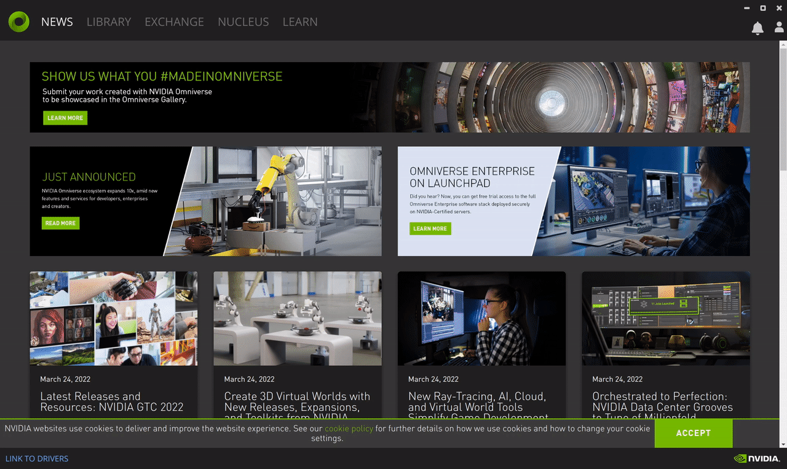
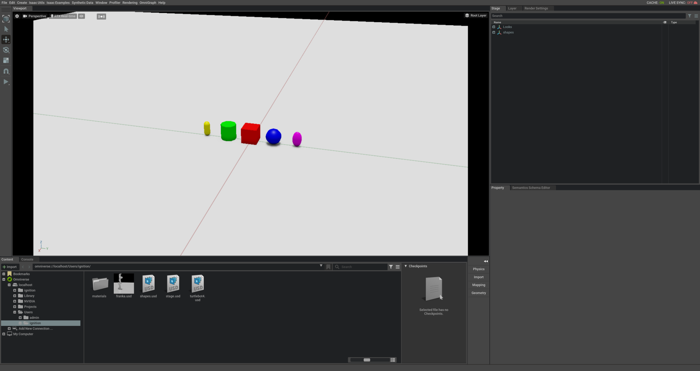

# Run it

Please review this [tutorial](./01_compile.md) if you need to install ign-omni.

## Run Ignition

Run the `shapes.sdf` world in Ignition Gazebo. This should run in a separate terminal using your normal Ignition Gazebo installation.

```bash
source ~/ignition-fortress/install/setup.bash
ign gazebo -v 4 shapes.sdf
```

## Run IsaacSim

If not already done so, install nvidia omniverse, isaac sim and omniverse nucleus, for more information, see https://www.nvidia.com/en-us/omniverse/.

### (Optional) Create ignition user in nucleus
When nucleus is first installed, it will prompt you to create a user. If the ignition user is not created at this time, it can be created later via the omniverse app.



Launch `IsaacSim` and activate the `live sync`


## Run the connector

And finally run:

**Note**: `ignition-omni` will be built under `src/ign-omni/_build`, this is because
it uses a custom build system by NVidia which is hard coded to put output in that directory.

In this case you need to source the special workspace that we have created
with the `ign-omni-meta` repository.

In a new terminal

```bash
source ~/ign-omni/install/setup.bash
cd ~/ign-omni/src/ign-omni
bash run_ignition_omni.sh -p omniverse://localhost/Users/ignition/shapes.usd -w shapes --pose ignition
```

You may replace `ignition` with any user registered in nucleus.

Open the `shapes.usd` in Isaac Sim and optionally enable live sync.


