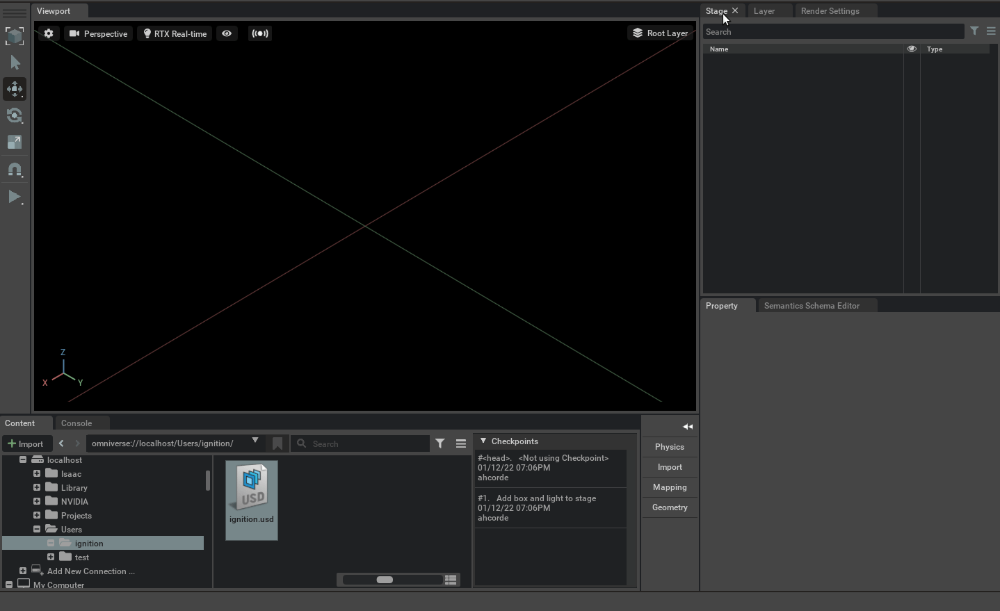

# Run a more complex simulation

<!-- TODO: Replace this with turtlebot4 instructions https://github.com/ignitionrobotics/ign-omni/pull/17 -->

For example you can run the turtlebot3. Compile the code from this PR https://github.com/ROBOTIS-GIT/turtlebot3_simulations/pull/180

Use ROS 2 Galactic.

```
mkdir -p ~/turtlebot3_ws/src
cd ~/turtlebot3_ws/src
git clone https://github.com/ahcorde/turtlebot3_simulations -b ahcorde/ignition_support
git clone https://github.com/ignitionrobotics/ign_ros2_control -b galactic
rosdep install --from-paths ./ -i -y --rosdistro galactic
```

Compile it

```bash
cd ~/turtlebot3_ws/
source /opt/ros/galactic/setup.sh
export IGNITION_VERSION=fortress
colcon build --merge-install --event-handlers console_direct+
```

## Run Ignition

This should run in a separate terminal using your normal Ignition Gazebo installation.

```bash
source ~/turtlebot3_ws/install/setup.bash
export TURTLEBOT3_MODEL=waffle ros2 launch turtlebot3_ignition ignition.launch.py
```

## Run IsaacSim

Launch `IsaacSim` and activate the `live sync`



## Run the connector

Create this directory `omniverse://localhost/Users/ignition/` in the nucleus server  and run the connector

```bash
reset && bash run_ignition_omni.sh -p omniverse://localhost/Users/ignition/turtlebot3.usd -w empty -v --pose ignition
```


