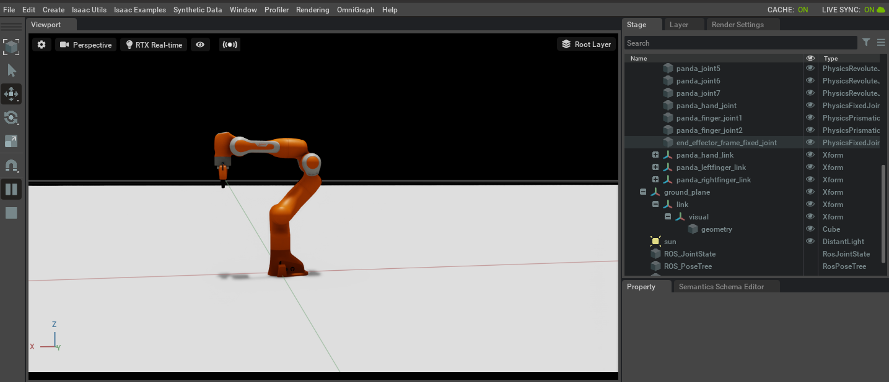

# Articulated arm connection from Isaac Sim to Ignition

In this tutorial we well explain how to use the connector from Issac Sim to Ignition

## Prerequisites
 - sdformat with USD support (see the [sdformat installation instructions](http://sdformat.org/tutorials?tut=install))
 - Ignition fuel tools cli command (see the [ign fuel tools installation instructions](https://ignitionrobotics.org/api/fuel_tools/7.0/install.html))
 - ign-omni Connector (see the [compile instructions](01_compile.md))
 - Omniverse Issac Sim
 - ros_ign_bridge
   - ROS: `sudo apt-get install ros-noetic-ros-ign-bridge`

## Convert USD to SDF

If sdformat is built with USD support, there should be a `usd2sdf` cli program.

```bash
SDF to USD converter
Usage: sdf2usd [OPTIONS] [input] [output]

Positionals:
  input TEXT                  Input filename. Defaults to input.sdf unless otherwise specified.
  output TEXT                 Output filename. Defaults to output.usd unless otherwise specified.

Options:
  -h,--help                   Print this help message and exit
  --help-all                  Show all help
  --version  
```

 - Convert the Panda Franka Emika robot to USD. Create the following file `panda.sdf`:
```xml
<?xml version="1.0" ?>
<sdf version="1.6">
  <world name="fuel">
    <physics name="1ms" type="ignored">
      <max_step_size>0.001</max_step_size>
      <real_time_factor>1.0</real_time_factor>
    </physics>

    <scene>
      <ambient>1.0 1.0 1.0 1.0</ambient>
      <background>0.8 0.8 0.8 1.0</background>
      <grid>false</grid>
      <origin_visual>false</origin_visual>
    </scene>

    <plugin
      filename="ignition-gazebo-physics-system"
      name="ignition::gazebo::systems::Physics">
    </plugin>
    <plugin
      filename="ignition-gazebo-sensors-system"
      name="ignition::gazebo::systems::Sensors">
      <render_engine>ogre2</render_engine>
    </plugin>
    <plugin
      filename="ignition-gazebo-user-commands-system"
      name="ignition::gazebo::systems::UserCommands">
    </plugin>
    <plugin
      filename="ignition-gazebo-scene-broadcaster-system"
      name="ignition::gazebo::systems::SceneBroadcaster">
    </plugin>

    <light type="directional" name="sun">
      <cast_shadows>true</cast_shadows>
      <pose>0 0 10 0 0 0</pose>
      <diffuse>0.8 0.8 0.8 1</diffuse>
      <specular>0.2 0.2 0.2 1</specular>
      <attenuation>
        <range>1000</range>
        <constant>0.9</constant>
        <linear>0.01</linear>
        <quadratic>0.001</quadratic>
      </attenuation>
      <direction>-0.5 0.1 -0.9</direction>
    </light>
    <include>
      <name>panda</name>
      <pose>0 0 0 0 0 0</pose>
      <uri>https://fuel.ignitionrobotics.org/1.0/OpenRobotics/models/Panda with Ignition position controller model</uri>
    </include>
    <model name="ground_plane">
      <static>true</static>
      <link name="link">
        <collision name="collision">
          <geometry>
            <plane>
              <normal>0 0 1</normal>
              <size>100 100</size>
            </plane>
          </geometry>
        </collision>
        <visual name="visual">
          <geometry>
            <plane>
              <normal>0 0 1</normal>
              <size>100 100</size>
            </plane>
          </geometry>
          <material>
            <ambient>0.8 0.8 0.8 1</ambient>
            <diffuse>0.8 0.8 0.8 1</diffuse>
            <specular>0.8 0.8 0.8 1</specular>
          </material>
        </visual>
      </link>
    </model>
  </world>
</sdf>
```

 - Download the panda model from fuel:
```bash
ign fuel download --url  "https://fuel.ignitionrobotics.org/1.0/OpenRobotics/models/Panda with Ignition position controller model"
```

 - Run the converter:
```bash
sdf2usd /panda.sdf panda.usd
```

 - Copy the file in this path `omniverse://localhost/Users/ignition/panda.usd`:


 - Load the model in Issac Sim and activate the `live sync`


 - Configure the ROS Plugins:
   - Add ROS Clock plugin
   - Add ROS joint state
      - Configure *articulationPrim* to `/fuel/panda`

 - Launch the simulation in Ignition Gazebo:
```bash
ign gazebo panda.sdf -v 4 -r
```

 - Launch the connector:
```bash
source ~/ign-omni/install/setup.bash
cd ~/ign-omni/src/ign-omni
bash run_ignition_omni.sh -p omniverse://localhost/Users/ignition/panda.usd -w fuel --pose ignition
```

 - Right now Issac Sim does not provide the joint angle, but this data is provided in ROS. You should launch a ROS -> Ignition bridge:
```bash
rosrun ros_ign_bridge parameter_bridge /joint_states@sensor_msgs/JointState]ignition.msgs.Model
```

 - Then you can move the robot. There is a workspace available here `.local/share/ov/pkg/isaac_sim-2021.2.1/ros_workspace/` that you need to compile it and run:
```bash
rosrun isaac_moveit franka_isaac_execution.launch
```
