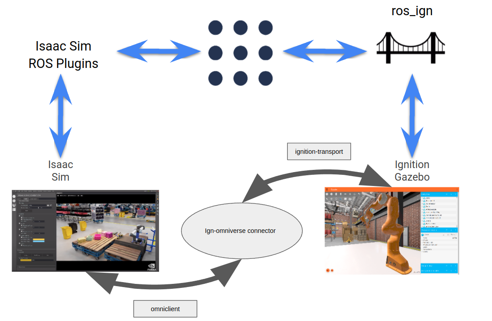
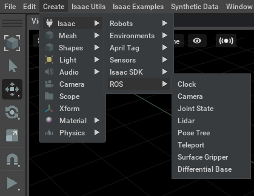
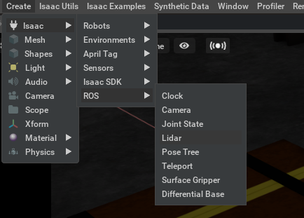
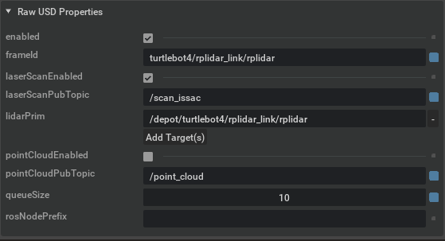
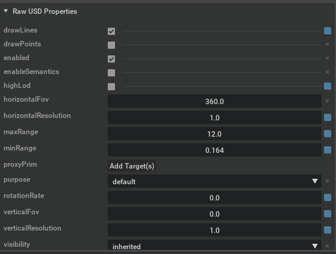
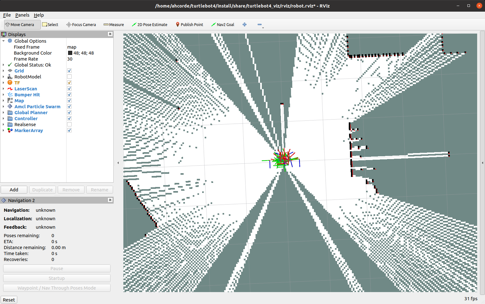

# Hybrid simulation

This demo explains how to use the hybrid simulation. The concept of Hybrid simulation is defined as: *A user can separate their simulation workload between Ignition
and Isaac Sim, with both systems running in parallel. For example, sensors can be handled by Isaac Sim, with rendering handled by Ignition, or vice versa.*

We can define more tangible examples, we can use some of the ROS frameworks such as the Nav stack or Moveit to use the ROS data from both simulators. For example:

 - Moveit: We can simulate in Ignition the joints of an articulated arm (sensing the data from the joints and sending commands to the joints) and in Isaac Sim we can simulate a camera attached to the robot or looking at the scene.
 - Nav stack: We can simulate in Ignition the diff drive controller and simulate all the sensors in Isaac Sim (Lidar, cameras, etc).

The possibilities are huge you just need to configure your on setup. In the following image is explained how the hybrid simulation works.



Both simulators will be connected using the `ign-omni` connector. The connector will share the data of the models pose and joints state. Then we can use ROS to send sensor data to the ROS network or received some commands to operate a motor.

Once the connector is running we need to defined which data from sensor or actuators is going to be provided by the different simulator.

 - Isaac Sim can share the data in the ROS network using some the predefined ROS plugins


 - Ignition uses `ros_ign_bridge`, this package provides a network bridge which enables the exchange of messages between ROS 2 and Ignition Transport. You can follow this tutorial to learn more about [how to use ROS Ignition bridges](https://docs.ros.org/en/galactic/Tutorials/Simulators/Ignition/Setting-up-a-Robot-Simulation-Ignition.html)

## Demo

In particular will follow this steps:

 - Launch a world containing a ROS 2-controlled robot.
 - Enable hybrid simulation, sharing the workload between Ignition and Isaac Sim
 - Control the robot from ROS 2
 - Visualize the data in the ROS network from both simulators in Rviz2

## Prerequisites
 - ign-omni Connector (see the [compile instructions](01_compile.md))
 - [Turtebot4 Simulation](https://github.com/turtlebot/turtlebot4_simulator)
 - Omniverse Issac Sim
   - [ROS & ROS2 Bridge](https://docs.omniverse.nvidia.com/app_isaacsim/app_isaacsim/ext_omni_isaac_ros_bridge.html)
 - [How to use ROS Ignition bridges](https://docs.ros.org/en/galactic/Tutorials/Simulators/Ignition/Setting-up-a-Robot-Simulation-Ignition.html)
   - ros_ign_bridge
     - ROS 2: `sudo apt-get install ros-galactic-ros-ign-bridge`

## Launch a world containing a ROS 2-controlled robot

In this case we are going to simulate the Turtebot4 available in this [repository](https://github.com/turtlebot/turtlebot4_simulator).

But first we are going to modify the lidar ros_ign_bridge bridge. Edit the file `~/turtlebot4_ws/src/turtlebot4_ignition_bringup/launch/ros_ign_bridge.launch.py`. We should remap the `/scan` ROS 2 topic to `/scan_ignition`. The original file is:

```python
remappings=[
    (['/world/', LaunchConfiguration('world'),
      '/model/', LaunchConfiguration('robot_name'),
      '/link/rplidar_link/sensor/rplidar/scan'],
     '/scan')
])
```

And you should modify it:

```python
remappings=[
    (['/world/', LaunchConfiguration('world'),
      '/model/', LaunchConfiguration('robot_name'),
      '/link/rplidar_link/sensor/rplidar/scan'],
     '/scan_ignition')
])
```

Now you should compile it. Follow the instructions in the [README.md](https://github.com/turtlebot/turtlebot4_simulator/blob/galactic/README.md) file to install it.

## Running the connector (ign-omni)

We need to compile some Ignition packages from source with a specific flag due the `omni-client` library.
To make this process simple we have created the [`ign-omni-meta` repository](https://github.com/ignitionrobotics/ign-omni-meta).

To compile this libraries you should run:

```bash
mkdir -p ~/ign-omni/src
cd ~/ign-omni/src
git clone https://github.com/ignitionrobotics/ign-omni-meta
vcs import . < ign-omni-meta/repos.yaml
cd protobuf
git -C . apply ../ign-omni-meta/protobuf-cmake.patch
cd ~/ign-omni
colcon build --merge-install --event-handlers console_direct+ --packages-select protobuf
cp src/ign-omni-meta/colcon.meta .
colcon build --merge-install --event-handlers console_direct+ --packages-up-to ignition-omni1
```

**Note**: `ignition-omni` will be built under `src/ign-omni/_build`, this is because
it uses a custom build system by NVidia which is hard coded to put output in that directory.

In this case you need to source the special workspace that we have created
with the `ign-omni-meta` repository.

Create an empty file in Nucleus in the following directory `omniverse://localhost/Users/ignition/turtlebot4.usd`

## Running the example:

### Run the ROS 2 simulation

You should run the Turtlebot4 simulation in Ignition, we are going to set to true the `slam` option to be able to create a map and navigate in the scene and we are going to set `rviz` to true too, in this case to visualize all the data from the nav2 stack in Rviz2:

```bash
source ~/turtlebot4_ws/install/setup.bash
ros2 launch turtlebot4_ignition_bringup ignition.launch.py slam:=true rviz:=true
```

### Run the connector

Once the simulation in Ignition is running we need to define some arguments to run the connector:

```bash
Ignition omniverse connector
Usage: ./_build/linux-x86_64/debug/ignition-omniverse1 [OPTIONS]

Options:
  -h,--help                   Print this help message and exit
  -p,--path TEXT REQUIRED     Location of the omniverse stage. e.g. "omniverse://localhost/Users/ignition/stage.usd"
  -w,--world TEXT REQUIRED    Name of the ignition world
  --pose ENUM:value in {ignition->0,isaacsim->1} OR {0,1} REQUIRED
                              Which simulator will handle the poses
  -v,--verbose                
```

In particular we need to define:

 - `-p,--path`: this is the file inside Omniverse, Isaac Sim and the connector are going to share it thanks to live sync mode. **This file must live in Omniverse**.
 - `-w,--world`: The name of the Ignition world
 - `--pose`: This option has two values: `ignition` or `isaacsim`. It defines how will handle the models pose and the joint states.

```bash
source ~/ign-omni/install/setup.bash
cd ~/ign-omni/src/ign-omni
bash run_ignition_omni.sh -p omniverse://localhost/Users/ignition/turtlebot4.usd -w depot -v --pose ignition
```

### Run Issac Sim

Launch `IssacSim`, load the file `omniverse://localhost/Users/ignition/turtlebot4.usd` and activate the `live sync`


### Let's configure Issac Sim

Include the LIDAR ROS plugin in Issac Sim



Configure the Plugin:

 - The frame_id should be `turtlebot4/rplidar_link/rplidar`
 - The laser scan topic `/scan_isaac`
 - The lidar prim `/depot/turtlebot4/rplidar_link/rplidar`



Configure the Issac Sim lidar:

 - Disable `highLod`
 - In case you want to visualize the data from the laser enable `drawLines`



Now enable the ROS 2 extension


There is an issue with the ROS 2 clock, for this reason we need to create a
simple republisher to update the timestamp of the lidar msgs.

Create a file called `lidar_republisher.py` and include this code:

```python
import rclpy
from rclpy.node import Node

from sensor_msgs.msg import LaserScan


class MinimalSubscriber(Node):

    def __init__(self):
        super().__init__('minimal_subscriber')
        self.subscription = self.create_subscription(
            LaserScan,
            '/scan_isaac',
            self.listener_callback,
            10)
        self.subscription  # prevent unused variable warning
        self.publisher_ = self.create_publisher(LaserScan, '/scan', 10)

        my_new_param = rclpy.parameter.Parameter(
            'use_sim_time',
            rclpy.Parameter.Type.BOOL,
            True
        )
        all_new_parameters = [my_new_param]
        self.set_parameters(all_new_parameters)

    def listener_callback(self, msg):
        msg.header.stamp = self.get_clock().now().to_msg()
        self.publisher_.publish(msg)


def main(args=None):
    rclpy.init(args=args)

    minimal_subscriber = MinimalSubscriber()

    rclpy.spin(minimal_subscriber)

    minimal_subscriber.destroy_node()
    rclpy.shutdown()


if __name__ == '__main__':
    main()
```

**Note: With this script you can choose how is going to provide the data from the lidar**
  - If you define `/scan_isaac` the data used is provided by Isaac Sim.
  - If you define `/scan_ignition` the data used is provided by Ignition Gazebo.

Launch the node:

```bash
source ~/turtlebot4_ws/install/setup.bash
python3 lidar_republisher.py
```

At this point you should be able to visualize the map in Rviz2. then you should be able to set some `Nav2 Goal` using the Rviz2 GUI.




