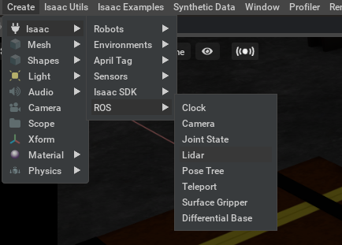
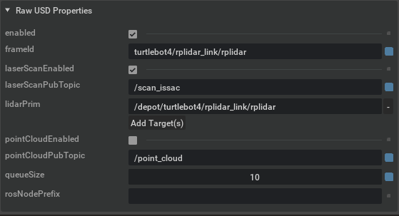

# Hybrid simulation

This demo explains how to use the hybrid simulation. In particular will follow this steps:

 - Launch a world containing a ROS 2-controlled robot.
 - Enable hybrid simulation, sharing the workload between Ignition and Isaac Sim
 - Control the robot from ROS 2
 - Visualize data from both simulators in RVIZ

## Launch a world containing a ROS 2-controlled robot

In this case we are going to simulate the Turtebot4 available in this [repository](https://github.com/turtlebot/turtlebot4_simulator).

But first we are going to modify the lidar bridge. Edit the file `~/turtlebot4_ws/src/turtlebot4_ignition_bringup/launch/ros_ign_bridge.launch.py`. We should remap the `/scan` ROS 2 topic to `/scan_ignition`. The original file is:

```python
remappings=[
    (['/world/', LaunchConfiguration('world'),
      '/model/', LaunchConfiguration('robot_name'),
      '/link/rplidar_link/sensor/rplidar/scan'],
     '/scan')
])
```

And you should modify it:

```python
remappings=[
    (['/world/', LaunchConfiguration('world'),
      '/model/', LaunchConfiguration('robot_name'),
      '/link/rplidar_link/sensor/rplidar/scan'],
     '/scan_ignition')
])
```

Now you should compile it. Follow the instructions in the [README.md](https://github.com/turtlebot/turtlebot4_simulator/blob/galactic/README.md) file to install it.

## Running the connector (ign-omni)

We need to compile some Ignition packages from source with a specific flag due the `omni-client` library.
To make this process simple we have created the [`ign-omni-meta` repository](https://github.com/ignitionrobotics/ign-omni-meta).

To compile this libraries you should run:

```bash
mkdir -p ~/ign-omni/src
cd ~/ign-omni/src
git clone https://github.com/ignitionrobotics/ign-omni-meta
vcs import . < ign-omni-meta/repos.yaml
cd protobuf
git -C . apply ../ign-omni-meta/protobuf-cmake.patch
cd ~/ign-omni
colcon build --merge-install --event-handlers console_direct+ --packages-select protobuf
cp src/ign-omni-meta/colcon.meta .
colcon build --merge-install --event-handlers console_direct+ --packages-up-to ignition-omni1
```

**Note**: `ignition-omni` will be built under `src/ign-omni/_build`, this is because
it uses a custom build system by NVidia which is hard coded to put output in that directory.

In this case you need to source the special workspace that we have created
with the `ign-omni-meta` repository.

Create an empty file in Nucleus in the following directory `omniverse://localhost/Users/ignition/turtlebot4.usd`


## Running the example:

### Run the ROS 2 simulation

```bash
source ~/turtlebot4_ws/install/setup.bash
ros2 launch turtlebot4_ignition_bringup ignition.launch.py slam:=true rviz:=true
```

### Run the connector

```bash
source ~/ign-omni/install/setup.bash
cd ~/ign-omni/src/ign-omni
bash run_ignition_omni.sh -p omniverse://localhost/Users/ignition/turtlebot4.usd -w depot -v --pose ignition
```

### Run Issac Sim

Launch `IssacSim`, load the file `omniverse://localhost/Users/ignition/turtlebot4.usd` and activate the `live sync`


### Let's configure Issac Sim

Include the LIDAR ROS plugin in Issac Sim



Configure the Plugin:

 - The frame_id should be `turtlebot4/rplidar_link/rplidar`
 - The laser scan topic `/scan_issac`
 - The lidar prim `/depot/turtlebot4/rplidar_link/rplidar`



Configure the Issac Sim lidar:

 - Disable `highLod`
 - In case you want to visualize the data from the laser enable `drawLines`


Now enable the ROS 2 extension


There is an issue with the ROS 2 clock, for this reason we need to create a
simple republisher to update the timestamp of the lidar msgs.

Create a file called `lidar_republisher.py` and include this code:

```python
import rclpy
from rclpy.node import Node

from sensor_msgs.msg import LaserScan


class MinimalSubscriber(Node):

    def __init__(self):
        super().__init__('minimal_subscriber')
        self.subscription = self.create_subscription(
            LaserScan,
            '/scan_issac',
            self.listener_callback,
            10)
        self.subscription  # prevent unused variable warning
        self.publisher_ = self.create_publisher(LaserScan, '/scan', 10)

        my_new_param = rclpy.parameter.Parameter(
            'use_sim_time',
            rclpy.Parameter.Type.BOOL,
            True
        )
        all_new_parameters = [my_new_param]
        self.set_parameters(all_new_parameters)

    def listener_callback(self, msg):
        msg.header.stamp = self.get_clock().now().to_msg()
        self.publisher_.publish(msg)


def main(args=None):
    rclpy.init(args=args)

    minimal_subscriber = MinimalSubscriber()

    rclpy.spin(minimal_subscriber)

    minimal_subscriber.destroy_node()
    rclpy.shutdown()


if __name__ == '__main__':
    main()
```

Launch the node:

```bash
source ~/turtlebot4_ws/install/setup.bash
python3 lidar_republisher.py
```

At this point you should be able to visualize the map in RVIZ


